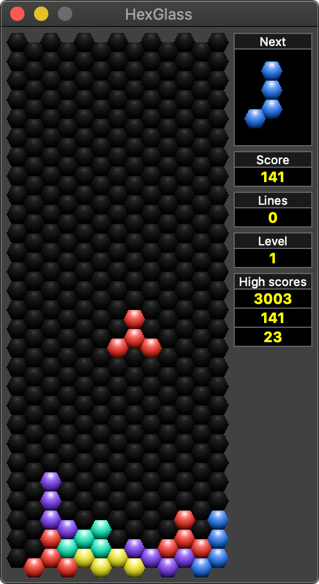

# HexGlass

The HexGlass is a Tetris-like puzzle game where
10 different types of blocks continuously fall
from above and you must arrange them to make
horizontal rows of hexagonal bricks.
Completing any row causes those hexagonal blocks
to disappear and the rest above move downwards.
The blocks above gradually fall faster and the
game is over when the screen fills up and blocks
can no longer fall from the top.

<p align="center"></p>

## Licensing

HexGlass is a Tetris-like puzzle game.

Project homepage: https://github.com/michurin/hexglass

Copyright (C) 2010-2020 Alexey Michurin <a.michurin@gmail.com>

This program is free software: you can redistribute it and/or modify
it under the terms of the GNU General Public License as published by
the Free Software Foundation, either version 3 of the License, or
(at your option) any later version.

This program is distributed in the hope that it will be useful,
but WITHOUT ANY WARRANTY; without even the implied warranty of
MERCHANTABILITY or FITNESS FOR A PARTICULAR PURPOSE. See the
GNU General Public License for more details.

You should have received a copy of the GNU General Public License
along with this program. If not, see <http://www.gnu.org/licenses/>.


## Build

Before building, you will need to have the Qt5 library and developers
tools installed on your system ([https://www.qt.io/](https://www.qt.io/)).

Build:

```sh
mkdir -p build
cd build
qmake .. # or qmake-qt5
make     # or gmake or mingw32-make or nmake or other
```

Test it:

```sh
./hexglass # or hexglass.exe ,-)
```

Install:

```sh
sudo make install
```

Uninstall:

```sh
sudo make uninstall
```

You can specify some options in build time.
Setup default size and skin:

```sh
qmake 'DEFINES += DEFAULT_SIZE=0 DEFAULT_SKIN=0'
```

## Contributors/Changelog

1.2.2

- Porting from Qt4 to Qt5. Thanks a lot to [Alexander Drozdov](https://github.com/h4tr3d).

1.2.1

- French locale. Thanks a lot to Vincent Petry <Vince81@opensuse.org>
  for translation and Kyrill Detinov <lazy.kent@opensuse.org> for assistance.
- Greek locale. Thanks a lot to Yannis Anthymidis <yannanth@gmail.com>.

1.2.0

- Stable release.

1.1.3

- Belarus locale updated by Prywid <prywid@mail.ru>.
- Ukrainian locale updated by Yurii Surzhynskyi <chugylo@gmail.com>.
- Czech locale updated by Miroslav Mazel <mazelm@gmail.com>
- Spanish locale updated by
  Ricardo A. Hermosilla Carrillo <ra.hermosillac@gmail.com>.
- Catalan locale updated by Marcel Baya <mbayaf@gmail.com>.
- China locale updated by Crazii and Sainthsu from ubuntu.org.cn.

1.1.2 (Version with incomplete localizations. For testers and localizators.)

- "High scores" box.
- "Careful dropping" mode.
- Some defaults can be setup in building time.
- Cosmetics.

1.1.1

- Czech locale. Thanks a lot to Miroslav Mazel <mazelm@gmail.com>
- Ukrainian locale. Thanks a lot to Yurii Surzhynskyi <chugylo@gmail.com>.

1.1.0

- Stable release.

1.0.9

- Space-key unpause game in pause mode.
- Cosmetics.

1.0.8

- China locale. Thanks a lot to Jie Luo <lililjlj@gmail.com>.

1.0.7

- Catalan locale. Thanks a lot to Marcel Baya <mbayaf@gmail.com>.
- Fix typo in English locale (affected to all locales);
  thanks a lot to Marcel Baya <mbayaf@gmail.com>.

1.0.6

- Spanish locale. Corrections by
  Ricardo A. Hermosilla Carrillo <ra.hermosillac@gmail.com>.

1.0.5

- Spanish locale. Thanks a lot to Tobias Diaz Diaz-Chiron <tobias.deb@gmail.com>.
- Minor cosmetics.

1.0.4

- Add CLI option -locale to force locale name.
- Load qm-file at (i) the location of translation information
  for Qt strings, (ii) directory that contains the application
  executable, (iii) at builin translations.
- Common color palette for all icons.

1.0.3

- Belarus locale. Thanks a lot to Prywid <prywid@mail.ru>.

1.0.2

- Skins and sizes moved to submenus.
- Autopause: freeze game on focus lost event.
- Minor cosmetics.

1.0.1

- Fix: icon for Mac OS X. Thanks to http://cypok.info for comprehensive testing.
- Add e-mail to "About".

1.0.0

- Initial release.

--
Alexey Michurin
